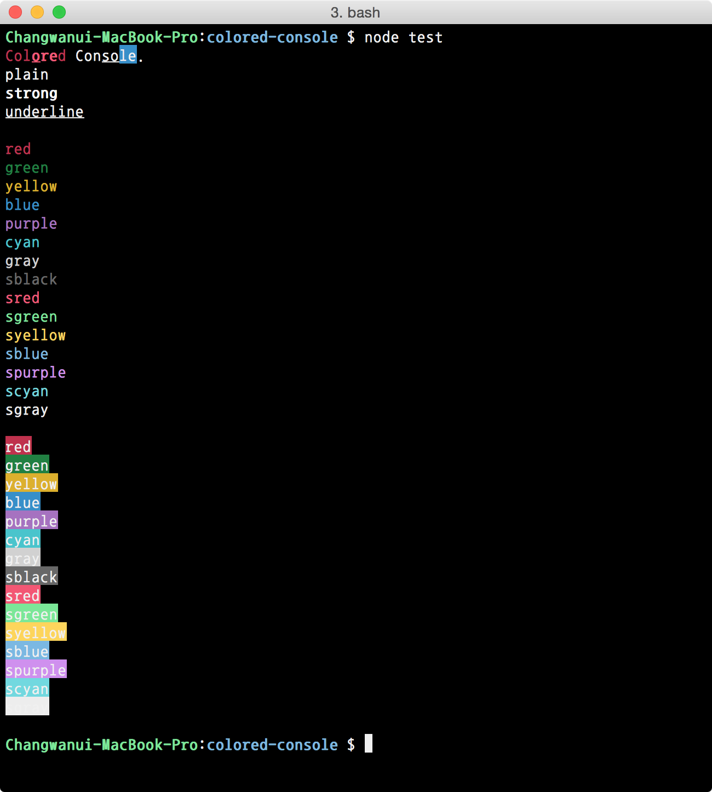

Styled Console
===



## Install

### npm

```bash
$ npm install styled-console
```

## How To Use

```js
var StyledConsole = require('styled-console');
console.log(StyledConsole("<c:red>St<b><u>y</u>le</b>d</c:red> Con<u>so</u><b:blue>le</b:blue>.").parse());
```

or

```js
var StyledConsole = require('styled-console');
console.log(new StyledConsole("<c:red>St<b><u>y</u>le</b>d</c:red> Con<u>so</u><b:blue>le</b:blue>.").parse());
```

## Tags

### color codes list

- black
- red
- green
- yellow
- blue
- purple
- cyan
- gray
- sblack
- sred
- sgreen
- syellow
- sblue
- spurple
- scyan
- sgray

### `<c:{colorCode}>` or `<color:{colorCode}>`

Change font color.

### `<b:{colorCode}>` or `<background:{colorCode}>`

Change background color.

### `<b>` or `<strong>`

Apply bold text.

### `<u>` or `<underline>`

Apply underlined text.


